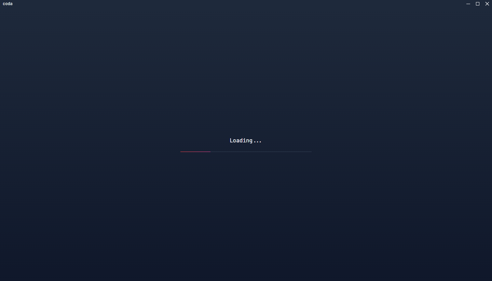
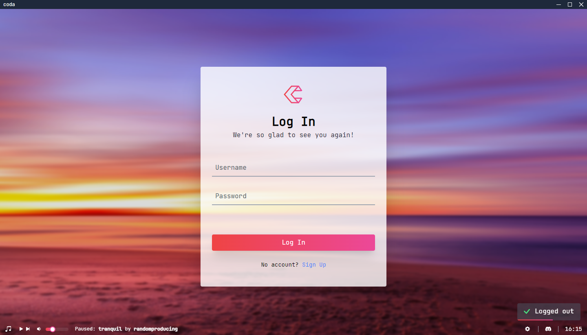
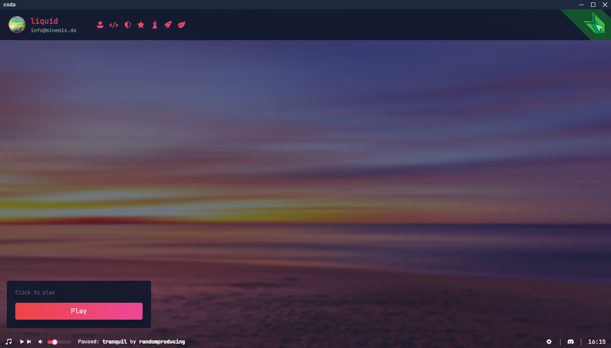
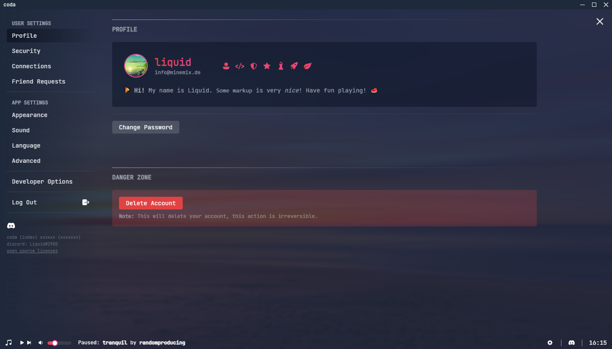
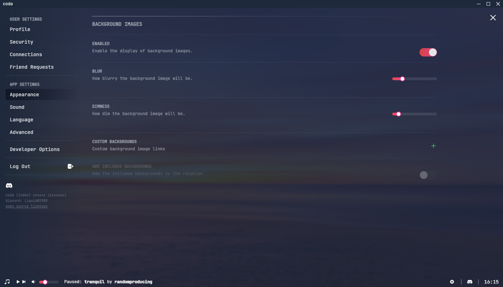
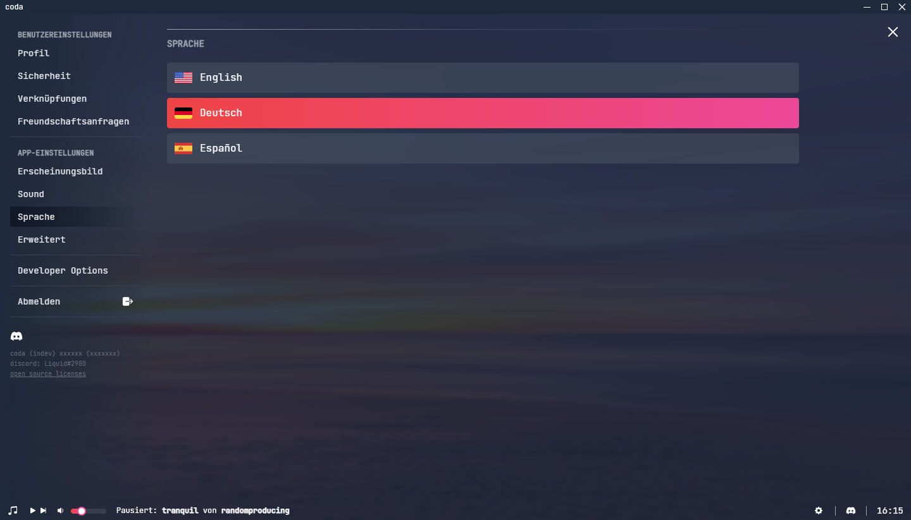
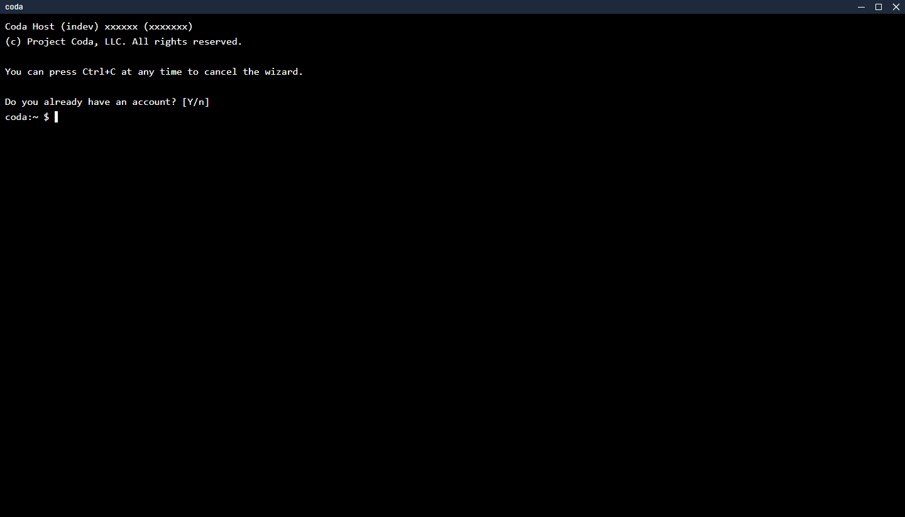
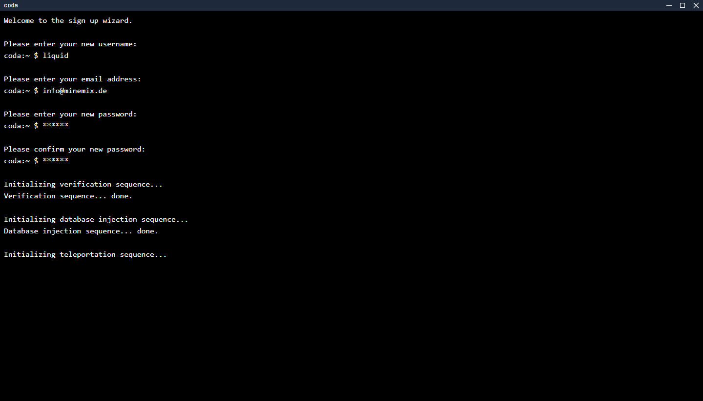
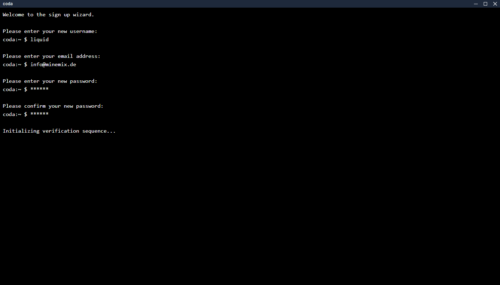
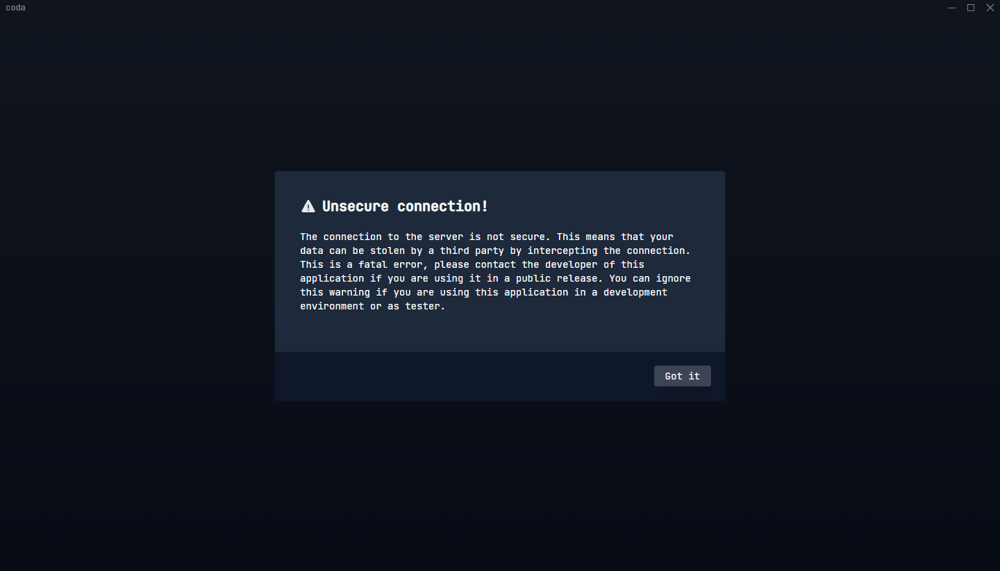

# 😢 The end of coda

Hi there, first of all: this repository may contain unfinished and probably not working code.

"Project Coda" was a project maintained by me and [@gsayson](//github.com/gsayson), due to private reasons this project sadly had to end, but since I put a lot of work in especially the frontier (desktop & web app) I thought I will just open source it, so people may get inspiration.

> Project Coda is a speed programming game where you solve a seemingly infinite set of problems until your opponents cannot keep up the pace.

With 2500 lines of code, and a hard time giving up all that work, thanks for the great time. ❤

 

You are welcome to use parts of this product in yours, but you have to respect the [license](LICENSE.md) and provide attribution.

**Any uses of this code in sense of a coding game and or under the name "Coda" or "Project Coda" is forbidden**

 

## Showcase

Here are **some** of the views you can get in the app at its current state, if you want to see more, you can run it by using the `yarn tauri dev` command.

